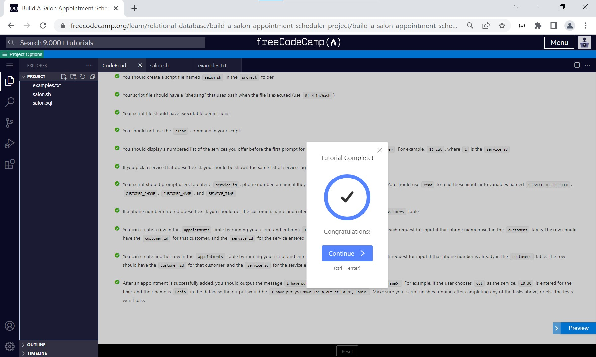
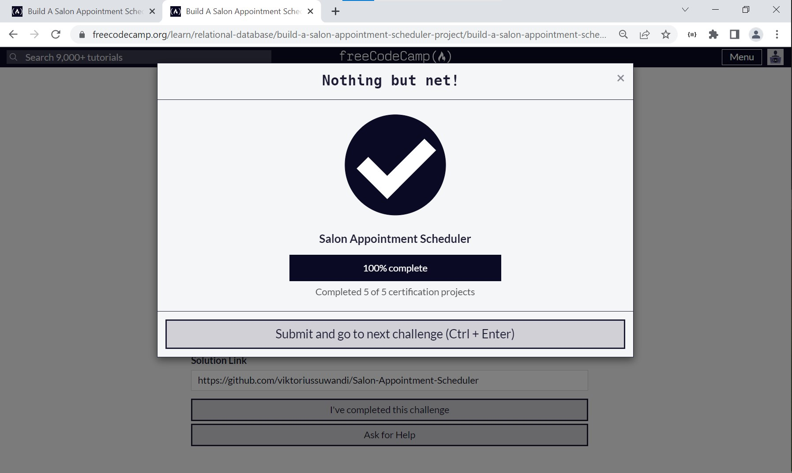

# Salon Appointment Scheduler
#### Open [file `solution.txt`](solution.txt) To follow my terminal command. Solutions divided into several steps :
    1. Create Database and connect to it.
    2. Create tables as required conditions.
    3. Fill table services with initial data.
    4. Primary Key and Foreign Key assignment.
    5. Compact queries into salon.sql file.
    6. Create shell scipt files and give executable permission to the file.
    7. Copy & Run shell script salon.sh file.

#### Documentation can be found on : [https://github.com/viktoriussuwandi/Salon-Appointment-Scheduler](https://github.com/viktoriussuwandi/Salon-Appointment-Scheduler)

This is the result to complete the Salon Appointment Scheduler project. 
Instructions for building this project can be found at [https://www.freecodecamp.org/learn/relational-database/build-a-salon-appointment-scheduler-project/build-a-salon-appointment-scheduler](https://www.freecodecamp.org/learn/relational-database/build-a-salon-appointment-scheduler-project/build-a-salon-appointment-scheduler)

## Instructions
Follow the instructions and get all the user stories below to pass to finish the project. Create your database by logging in to psql with `psql --username=freecodecamp --dbname=postgres`. You can query the database in your script with `psql --username=freecodecamp --dbname=salon -c "SQL QUERY HERE"`, add more flags if you need to. Be sure to get creative, and have fun!

**Don't forget to connect to your database to add tables after you create it** 😄

Hints:
Your script needs to finish running after doing any of the tasks described below or the tests won't pass
The tests check the script output so don't use `clear` or other commands which might erase it
See `examples.txt` for example output of a passing script
The tests may add data to your database, feel free to delete it
Notes:
If you leave your virtual machine, your database may not be saved. You can make a dump of it by entering `pg_dump -cC --inserts -U freecodecamp salon > salon.sql` in a bash terminal (not the psql one). It will save the commands to rebuild your database in salon.sql. The file will be located where the command was entered. If it's anything inside the project folder, the file will be saved in the VM. You can rebuild the database by entering `psql -U postgres < salon.sql` in a terminal where the `.sql` file is.

If you are saving your progress on [freeCodeCamp.org](freeCodeCamp.org), after getting all the tests to pass, follow the instructions above to save a dump of your database. Save the `salon.sql` file, as well as the final version of your `salon.sh` file, in a public repository and submit the URL to it on [freeCodeCamp.org](freeCodeCamp.org).

## CodeRoad
1. You should create a database named `salon`.
2. You should connect to your database, then create tables named `customers`, `appointments`, and `services`.
3. Each table should have a `primary key` column that automatically increments.
4. Each `primary key` column should follow the naming convention, `table_name_id`. For example, the `customers` table should have a `customer_id` key. Note that there’s no s at the end of `customer`.
5. Your `appointments` table should have a customer_id foreign key that references the `customer_id` column from the `customers` table.
6. Your `appointments` table should have a `service_id` foreign key that references the `service_id` column from the `services` table.
7. Your `customers` table should have phone that is a `VARCHAR` and must be `unique`.
8. Your `customers` and `services` tables should have a `name` column.
9. Your `appointments` table should have a `time` column that is a `VARCHAR`.
10. You should have at least three rows in your `services` table for the different services you offer, one with a `service_id` of `1`.
11. You should create a script file named `salon.sh` in the project folder.
12. Your script file should have a `“shebang”` that uses `bash` when the file is executed (use `#! /bin/bash`).
13. Your script file should have executable permissions.
14. You should not use the `clear` command in your script.
15. You should display a numbered list of the services you offer before the first prompt for input, each with the format `#) <service>`. For example, `1) cut`, where `1` is the `service_id`.
16. If you pick a service that doesn't exist, you should be shown the same list of services again.
17. Your script should prompt users to enter a `service_id`, `phone number`, a `name` if they aren’t already a `customer`, and a `time`. You should use `read` to read these inputs into variables named `SERVICE_ID_SELECTED`, `CUSTOMER_PHONE`, `CUSTOMER_NAME`, and `SERVICE_TIME`.
18. If a `phone number` entered doesn’t `exist`, you should get the `customers name` and enter it, and the `phone number`, into the `customers` table.
19. You can create a row in the `appointments` table by running your script and entering `1`, `555-555-5555`, `Fabio`, `10:30` at each `request` for input if that `phone number` isn’t in the `customers` table. The row should have the `customer_id` for that `customer`, and the `service_id` for the `service` entered.
20. You can create another row in the `appointments` table by running your script and entering `2`, `555-555-5555`, `11am` at each request for `input` if that `phone number` is already in the `customers` table. The row should have the `customer_id` for that `customer`, and the `service_id` for the `service` entered.
21. After an `appointment` is successfully added, you should output the message `I have put you down for a <service> at <time>, <name>`. For example, if the user chooses `cut` as the `service`, `10:30` is entered for the `time`, and their `name` is `Fabio` in the database the output would be `I have put you down for a cut at 10:30, Fabio`. Make sure your script finishes running after completing any of the tasks above, or else the tests won't pass.

## Result

### Testing

### Submission
